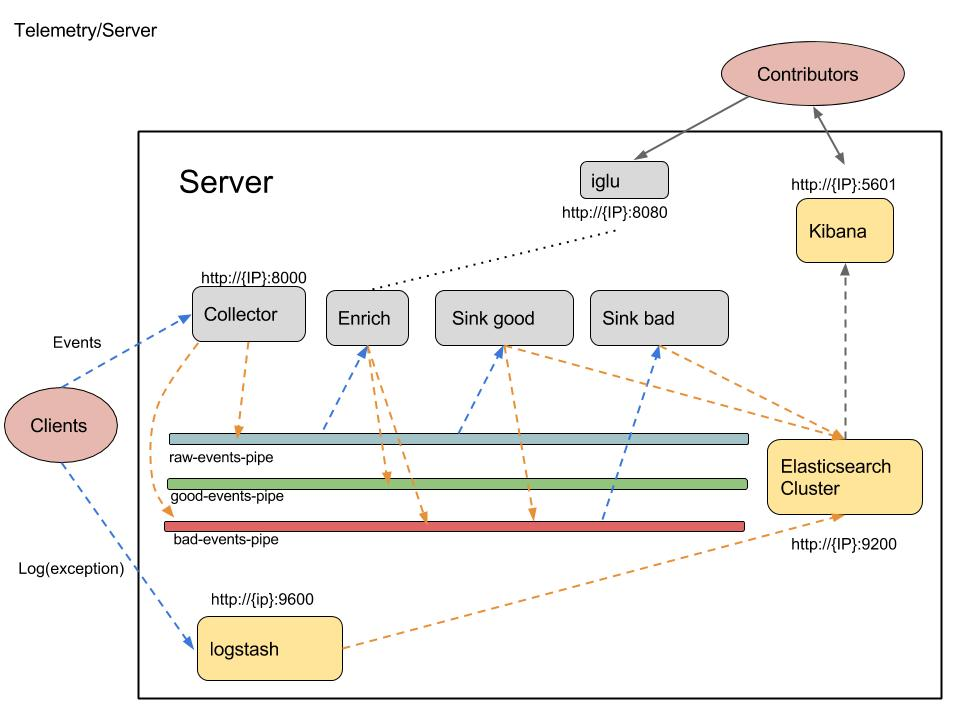

Telemetry
=========

A docker project of telemetry system using [Snowplow](https://github.com/snowplow/snowplow) and logstash.

Overview
--------
More details in [wiki](https://github.com/GabrielXia/telemetry/wiki)

Setup
------

[Docker](https://www.docker.com/get-docker) and [Docker Compose](https://docs.docker.com/compose/install/) required
1. Download this repository `git clone https://github.com/GabrielXia/telemetry.git`
2. Change to `docker` directory `cd telemetry/docker`
3. Build `docker-compose build`
4. Start `docker-compose up`
5. End `docker-compose down`

**Note** Don't forget to `docker-compose down` to delete all the docker containers! Or there will be issues like in `iglu` uses the ancient container and doesn't set up correctlly.

Test
----

#### Testing logstash

- Clone repository [tracker8](https://github.com/GabrielXia/tracker8): `git clone https://github.com/GabrielXia/tracker8.git`
- Import as a gradle project
- run `tracker8/src/main/java/LogstashTest.java` which will send error log to the telemetry system

#### Testing metric event

- Clone repository [tracker8](https://github.com/GabrielXia/tracker8): `git clone https://github.com/GabrielXia/tracker8.git`
- Import as a gradle project
- run `tracker8/src/main/java/trackerMain.java` which will send fake metric to the telemetry system
- You can using snowplow-mini ui: go to http://localhost:80 `Example events` page, and press the buttons

#### Verify metrics are sent

- using `curl 'localhost:9200/_cat/indices?v'` to see the indexes in Elasticsearch
- Go to kibana page: http://localhost:5601. You might have to firstly configure the index pattern
  - go to `Settings` page, choose `Index contains time-based events`
  - In `Index name or pattern`, enter `logstash-*` then in `Time-field name` choose `timestamp` to visualise log data
  - In `Index name or pattern`, enter `good` then in `Time-field name` choose `collector_tstamp` to visualise good metric data
  - In `Index name or pattern`, enter `bad` then in `Time-field name` choose `failure_tstamp` to visualise bad metric data

#### Issue
If you found problems, don't hesitate to leave an [issue](https://github.com/GabrielXia/telemetry/issues)
