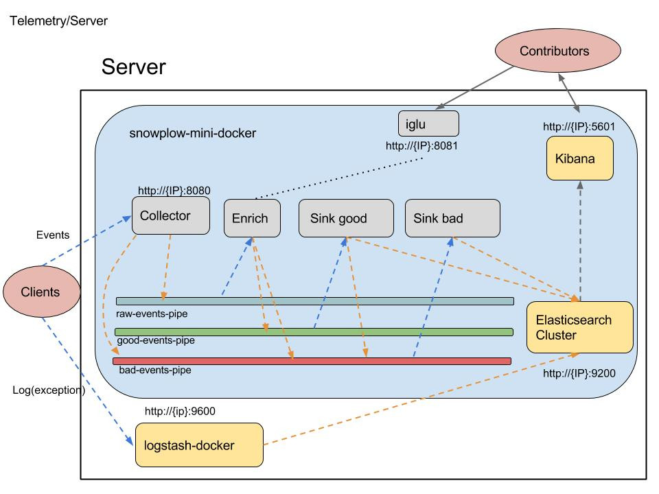

Telemetry
=========

A docker project of telemetry system using [Snowplow](https://github.com/snowplow/snowplow) and logstash.

Overview
--------

This system receives events and logs (exceptions) from clients, selects good events and stores the information in [elasticsearch](https://github.com/elastic/elasticsearch). We can visualise them via [Kibana](https://github.com/elastic/kibana).

This telemetry system bases on [Snowplow-Mini](https://github.com/snowplow/snowplow-mini). And it used a [snowplow-mini docker image](https://hub.docker.com/r/mrosack/snowplow-mini/) and an official logstash image.

Check java client prototype in [tracker8](https://github.com/GabrielXia/tracker8), you can also find other trackers in [Snowplow](https://github.com/snowplow/snowplow/tree/master/1-trackers).

Setup
------

[Docker](https://www.docker.com/get-docker) and [Docker Compose](https://docs.docker.com/compose/install/) required
1. Download this repository `git clone https://github.com/GabrielXia/telemetry.git`
2. Change to `docker` directory `cd telemetry/docker`
3. Build `docker-compose build`
4. Start `docker-compose up`
5. End `docker-compose down`

That's easy! If you found problems, don't hesitate an [issue](https://github.com/GabrielXia/telemetry/issues)

Test
----

Topology
--------

Here is the diagram ：

- Collector([snowplow-stream-collector-0.9.0](https://github.com/snowplow/snowplow/tree/master/2-collectors/scala-stream-collector)) :
  - Collects events from clients on port 8000
  - Sends "good" event to `raw-events-pipe`
  - Sends "bad" event to `bad-events-pipe`
- Enrich([snowplow-stream-enrich-0.10.0](https://github.com/snowplow/snowplow/tree/master/3-enrich/stream-enrich)):
  - Reads events from the `raw-events-pipe`
  - Checks if the event type is registered in `iglu`
  - Sends "good" events to `good-events-pipe`
  - Sends "bad" events to the `bad-events-pipe`
- iglu([iglu-server-0.2.0.jar](https://github.com/snowplow/iglu)) :
  - Stores registered event json schema
  - Contributors can register new json schema for a custum event
- Sink good([snowplow-elasticsearch-sink-0.8.0-2x](https://github.com/snowplow/snowplow/tree/master/4-storage/kinesis-elasticsearch-sink))
  - Reads events in from the `good-events-pipe`
  - Sends the events to the "good" index of elasticsearch cluster
  - On failure to insert writes error to `bad-events-pipe`
- Sink bad([snowplow-elasticsearch-sink-0.8.0-2x](https://github.com/snowplow/snowplow/tree/master/4-storage/kinesis-elasticsearch-sink)) :
  - Reads events in from `bad-events-pipe`
  - Sends the events to the "bad" index of elasticsearch cluster
- logstash([logstash-5.2.2](https://github.com/elastic/logstash)) :
  - Collects logs on port 9600 ( [tracker8](https://github.com/GabrielXia/tracker8) uses [logback LogstashTcpSocketAppender](https://github.com/logstash/logstash-logback-encoder) to output log data, logstash also supports other log tools)
  - Sends json form log to elasticsearch cluster
- Elasticsearch Cluster([elasticsearch-2.4.4](https://github.com/elastic/elasticsearch))
  - Stores data on port 9200
  - Provides data to kibana
- Kibana([kibana-4.6.4-darwin-x86_64](https://github.com/elastic/kibana))
  - A browser-based analytics and search dashboard
