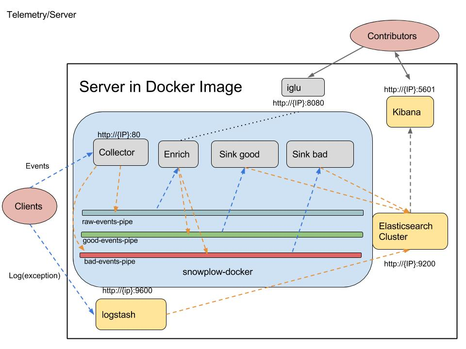

# Telemetry
An prototype of telemetry system runs in server (using [Snowplow](https://github.com/snowplow/snowplow))
### Overview
This system receives events and logs s(exceptions) from clients, selects good events and stores the information in [elasticsearch](https://github.com/elastic/elasticsearch). We can analyze this information via [Kibana](https://github.com/elastic/kibana).

This telemetry system bases on [Snowplow-Mini](https://github.com/snowplow/snowplow-mini).
Check java client prototype in [tracker8](https://github.com/GabrielXia/tracker8), you can also find other trackers in [Snowplow](https://github.com/snowplow/snowplow/tree/master/1-trackers).

### Topology
Here is the diagram ：

- Collector([snowplow-stream-collector-0.9.0](https://github.com/snowplow/snowplow/tree/master/2-collectors/scala-stream-collector)) :
  - Collects events from clients on port 8000
  - Sends "good" event to `raw-events-pipe`
  - Sends "bad" event to `bad-events-pipe`
- Enrich([snowplow-stream-enrich-0.10.0](https://github.com/snowplow/snowplow/tree/master/3-enrich/stream-enrich)):
  - Reads events from the `raw-events-pipe`
  - Checks if the event type is registered in `iglu`
  - Sends "good" events to `good-events-pipe`
  - Sends "bad" events to the `bad-events-pipe`
- iglu([iglu-server-0.2.0.jar](https://github.com/snowplow/iglu)) :
  - Stores registered event json schema
  - Contributors can register new json schema for a custum event
- Sink good([snowplow-elasticsearch-sink-0.8.0-2x](https://github.com/snowplow/snowplow/tree/master/4-storage/kinesis-elasticsearch-sink))
  - Reads events in from the `good-events-pipe`
  - Sends the events to the "good" index of elasticsearch cluster
  - On failure to insert writes error to `bad-events-pipe`
- Sink bad([snowplow-elasticsearch-sink-0.8.0-2x](https://github.com/snowplow/snowplow/tree/master/4-storage/kinesis-elasticsearch-sink)) :
  - Reads events in from `bad-events-pipe`
  - Sends the events to the "bad" index of elasticsearch cluster
- logstash([logstash-5.2.2](https://github.com/elastic/logstash)) :
  - Collects logs on port 9600 ( [tracker8](https://github.com/GabrielXia/tracker8) uses [logback LogstashTcpSocketAppender](https://github.com/logstash/logstash-logback-encoder) to output log data, logstash also supports other log tools)
  - Sends json form log to elasticsearch cluster
- Elasticsearch Cluster([elasticsearch-2.4.4](https://github.com/elastic/elasticsearch))
  - Stores data on port 9200
  - Provides data to kibana
- Kibana([kibana-4.6.4-darwin-x86_64](https://github.com/elastic/kibana))
  - A browser-based analytics and search dashboard

### Set up
1. You need to set up [elasticsearch](https://github.com/elastic/elasticsearch), [kibana](https://github.com/elastic/kibana), and [logstash](https://github.com/elastic/logstash)
2. You can find snowplow collect, enrich and sink either here or in [Snowplow](https://github.com/snowplow/snowplow)
3. To set up iglu, you need also to set up [postgresql]( https://www.postgresql.org/), see detail [here](https://github.com/snowplow/iglu/wiki/Scala-repo)
4. With the configure files in [configs](https://github.com/GabrielXia/telemetry/tree/master/configs) and the [shell command](https://github.com/GabrielXia/telemetry/blob/master/run.sh), I think you can easily set up this system in OSX or Linux

### Some ideas
Apart from normal metrics, we could also provide a "light feedback report system", we can create a custum event named `feedbackEvent`, users can write their feedback in a `feedbackOverlay` and the feedback will be sent to server automatically.

### FeedBack Please
Are you happy with this system ? Feel free to tell me your feeling either in [Issues](https://github.com/GabrielXia/telemetry/issues) or [forum](http://forum.terasology.org/threads/telemetry-system-collect-analyze-and-report.1799/).
